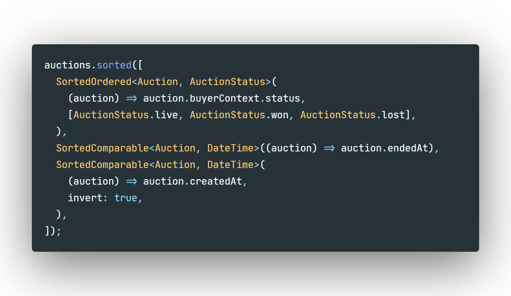

# sorted

[![Package on pub.dev][pub-badge]][pub-link]
[![Test suite][tests-badge]][tests-link]

Sort lists of complex objects with ease.

<div align="center">
    
</div>

## Usage

Add the package to your `pubspec.yaml`:

```yaml
dependencies:
  sorted: <newest version>
```

Import the package:

```dart
import 'package:sorted/sorted.dart';
```

Call `sorted` extension method on any list and pass sorting rules of your choice. Order matters, so if first rule considers two items equal, next one will decide and so on.

## Sorting rules

All rules have an optional named argument `invert` which inverts the sorting order.

### `SortedOrdered`

```dart
SortedOrdered<Auction, AuctionStatus>(
  (auction) => auction.buyerContext.status,
  [AuctionStatus.live, AuctionStatus.won, AuctionStatus.lost],
)
```

Sorts items by the mapped property value in an order passed as a second argument. In this example, live auctions will be first, then won, and then lost.

### `SortedGroupOrdered`

```dart
SortedOrdered<Road, RoadType>(
  (road) => road.type,
  [
    [RoadType.nationalHighway, RoadType.stateHighway],
    [RoadType.district],
    [RoadType.dirt],
  ],
)
```

Sorts items by the mapped property value in the order of order groups, but all values withing a certain group are considered equal.

### `SortedComparable`

```dart
SortedComparable<User, String>((user) => user.lastName)
```

Sorts items by the mapped property value using `Comparable.compare` which is basically `a.compareTo(b)`. Sorts strings alphabetically, numbers ascending, etc.

### `SortedComparator`

```dart
SortedComparator<Auction, String>(
  (auction) => auction.buyerContext.status,
  (a, b) =>  /* your custom compare function */,
)
```

Sorts items by the mapped property value using a custom comparator provided as a second argument.

[pub-link]: https://pub.dev/packages/sorted
[pub-badge]: https://img.shields.io/pub/v/sorted
[tests-link]: https://github.com/Albert221/sorted/actions?query=workflow%3ATest
[tests-badge]: https://img.shields.io/github/workflow/status/Albert221/sorted/Test
